# Data Structure

This document describes the core data models, database tables, and invariants behind the inventory (UTXO), sales, quotes, and payment systems.

## Overview

The system uses two append-only ledger patterns inspired by Bitcoin's UTXO (Unspent Transaction Output) model:

1. **Inventory UTXOs** -- each lot of received goods is an immutable output that gets "spent" by a sale.
2. **Payment UTXOs** -- each payment against a quote is an immutable entry in an append-only ledger.

Both systems avoid in-place mutations. State is derived by scanning the ledger, not by updating running totals.

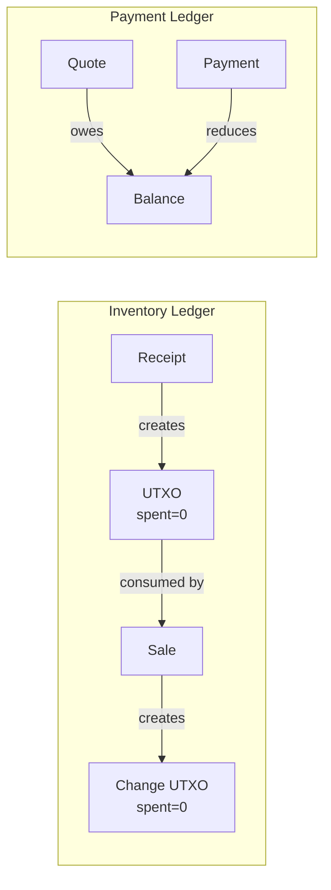

## Monetary Amounts

All monetary values are stored as **INTEGER cents** (i64) in the database. The `Amount` type converts to/from `f64` at the JSON boundary:

```
Amount(4500000)  -->  JSON: 45000.00
Amount::from_float(45000.00)  -->  Amount(4500000)
```

This eliminates floating-point precision issues in financial calculations.

---

## Inventory System

### Tables

#### `inventory_receipts`

A receipt represents a purchase or incoming shipment event.

| Column | Type | Description |
|---|---|---|
| id | INTEGER PK | |
| reference | TEXT | Supplier invoice number or reference |
| supplier_name | TEXT | |
| notes | TEXT | |
| received_at | TEXT | Timestamp (defaults to now) |
| created_at | TEXT | |

#### `inventory_utxos`

The core of the inventory system. Each row is an **individual lot** of a product at a specific warehouse. Rows are never deleted or modified, except to mark them as spent.

| Column | Type | Description |
|---|---|---|
| id | INTEGER PK | |
| product_id | INTEGER FK | References `products(id)` |
| warehouse_id | INTEGER FK | References `warehouses(id)` |
| quantity | REAL | Must be > 0 (CHECK constraint) |
| cost_per_unit | INTEGER | Cents. Must be >= 0 (CHECK constraint) |
| receipt_id | INTEGER FK | Set when created by a receipt (purchase) |
| source_sale_id | INTEGER FK | Set when created as "change" from a sale |
| spent | INTEGER | 0 = unspent, 1 = spent. Only valid mutation: 0 -> 1 |
| spent_by_sale_id | INTEGER FK | Which sale consumed this UTXO |
| created_at | TEXT | |

**Key invariants:**
- `quantity > 0` -- enforced by CHECK constraint
- `cost_per_unit >= 0` -- enforced by CHECK constraint
- `spent` only transitions from 0 to 1, never back
- Every UTXO has either a `receipt_id` (it came from a purchase) or a `source_sale_id` (it's change from a partial sale), never both
- Current stock = `SUM(quantity) WHERE spent = 0` grouped by product + warehouse

**Index:** `idx_utxo_unspent` on `(product_id, warehouse_id) WHERE spent = 0` -- critical for fast stock lookups.

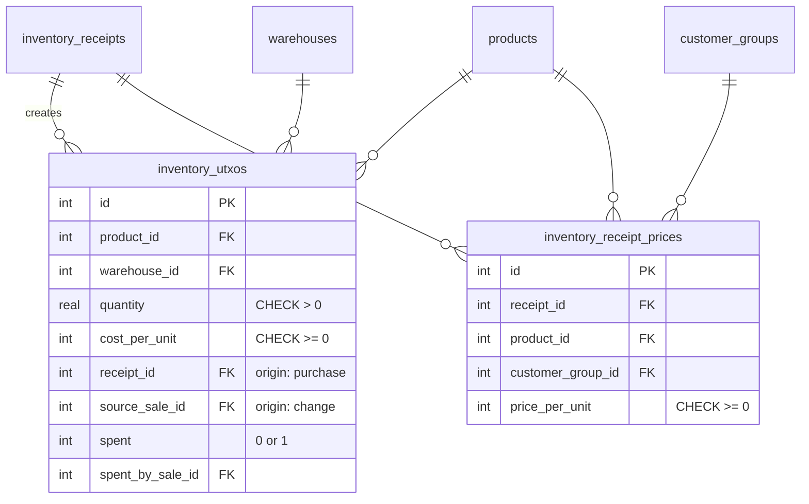

#### `inventory_receipt_prices`

Stores the selling price for each product per customer group, set at the time of each receipt.

| Column | Type | Description |
|---|---|---|
| id | INTEGER PK | |
| receipt_id | INTEGER FK | |
| product_id | INTEGER FK | |
| customer_group_id | INTEGER FK | |
| price_per_unit | INTEGER | Cents. Must be >= 0 |

**Constraint:** `UNIQUE(receipt_id, product_id, customer_group_id)` -- one price per product per group per receipt.

The latest price for a product is determined by finding the `MAX(receipt_id)` for each `(product_id, customer_group_id)` pair.

### How a Receipt Works

When inventory is received:

1. An `inventory_receipts` row is created.
2. For each product line, an `inventory_utxos` row is created with `spent = 0` and the `receipt_id` set.
3. For each customer group, an `inventory_receipt_prices` row records the selling price.

All steps run in a single transaction.

### How Current Stock Is Calculated

```sql
SELECT product_id, warehouse_id, SUM(quantity) as total_quantity
FROM inventory_utxos
WHERE spent = 0
GROUP BY product_id, warehouse_id
```

No running totals are maintained. Stock is always derived from unspent UTXOs.

---

## Sales System

### Tables

#### `sales`

| Column | Type | Description |
|---|---|---|
| id | INTEGER PK | |
| customer_id | INTEGER FK | |
| customer_group_id | INTEGER FK | Determines pricing tier |
| notes | TEXT | |
| total_amount | INTEGER | Cents. Sum of all line totals |
| sold_at | TEXT | |
| created_at | TEXT | |

#### `sale_lines`

| Column | Type | Description |
|---|---|---|
| id | INTEGER PK | |
| sale_id | INTEGER FK | |
| product_id | INTEGER FK | |
| quantity | REAL | Must be > 0 |
| price_per_unit | INTEGER | Cents |
| created_at | TEXT | |

#### `sale_line_utxo_inputs`

Audit trail linking each sale line to the UTXOs it consumed.

| Column | Type | Description |
|---|---|---|
| id | INTEGER PK | |
| sale_line_id | INTEGER FK | |
| utxo_id | INTEGER FK | |
| quantity_used | REAL | Must be > 0. How much of that UTXO was used |

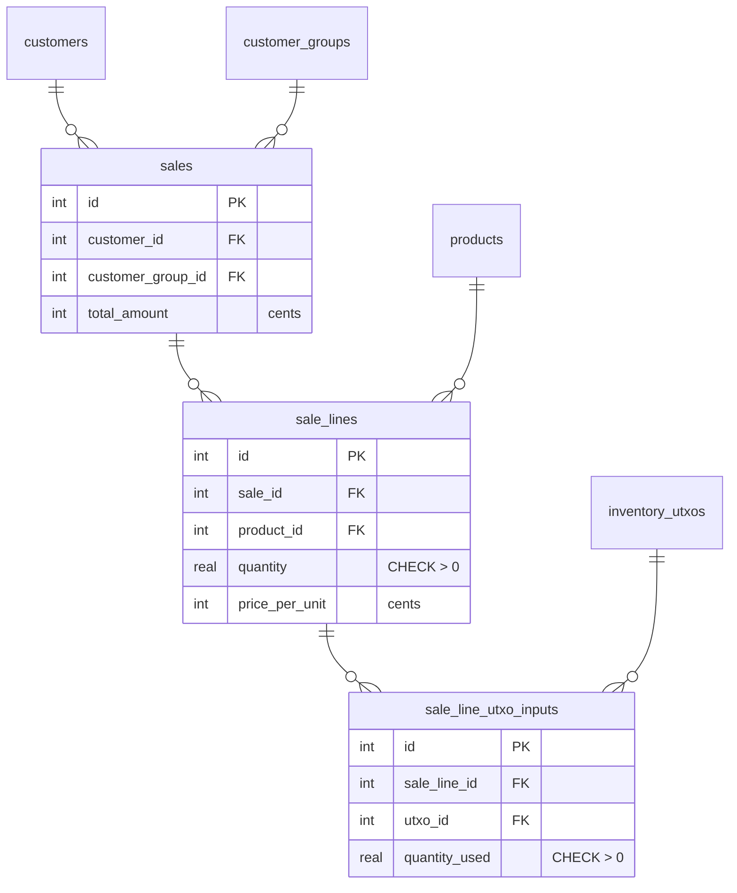

### How a Sale Consumes Stock (FIFO)

When a sale is created, the system processes each line item:

1. Query all unspent UTXOs for the product + warehouse, ordered by `created_at ASC` (FIFO).
2. Walk the UTXOs from oldest to newest:
   - Mark each UTXO as `spent = 1`, recording `spent_by_sale_id`.
   - Record the consumption in `sale_line_utxo_inputs`.
   - If the UTXO is only partially consumed, create a **change UTXO** with the remainder. The change UTXO inherits `cost_per_unit` from the original and sets `source_sale_id` instead of `receipt_id`.
3. If there isn't enough stock to fulfill the line, the entire transaction is rolled back and an `InsufficientStock` error is returned.

**Example: partial consumption with change**

100 bags received at 45,000/bag. Customer buys 30.

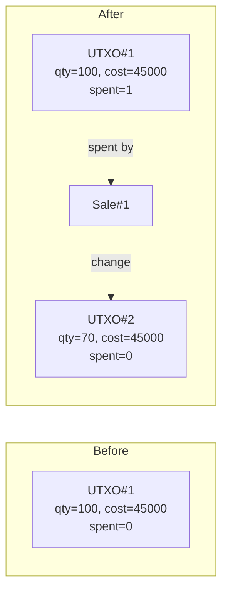

**Example: FIFO across multiple lots**

Two lots (20 @ 40,000 then 20 @ 50,000). Customer buys 25.

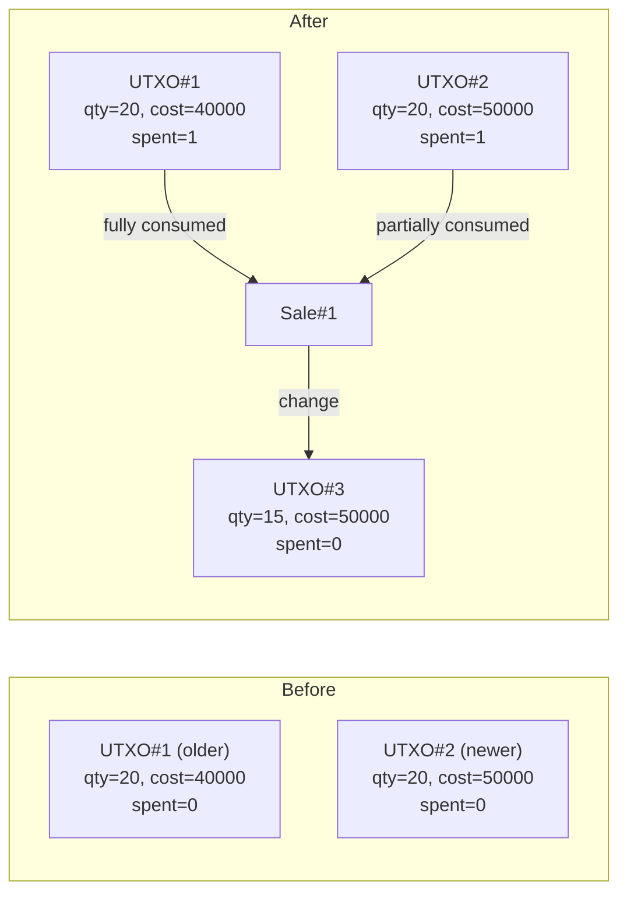

### Invariants

- **Conservation:** Total quantity across all UTXOs (spent + unspent) for a product always equals total received quantity. Stock is never created or destroyed, only transferred.
- **No double-spend:** Once `spent = 1`, the UTXO is excluded from future stock queries by the partial index.
- **Atomicity:** The entire sale (all lines) succeeds or fails as one transaction. A failed line rolls back all changes.
- **Audit trail:** Every consumption is recorded in `sale_line_utxo_inputs`, making it possible to trace exactly which lots fed each sale.

---

## Quotes System

### Tables

#### `quotes`

| Column | Type | Description |
|---|---|---|
| id | INTEGER PK | |
| customer_id | INTEGER FK | |
| status | TEXT | One of: `draft`, `sent`, `follow_up`, `accepted`, `booked` (CHECK constraint) |
| title | TEXT | |
| description | TEXT | |
| total_amount | INTEGER | Cents |
| is_debt | INTEGER | 0 = regular quote, 1 = debt entry |
| valid_until | TEXT | Optional expiration date |
| created_at | TEXT | |
| updated_at | TEXT | |

**Status lifecycle:**

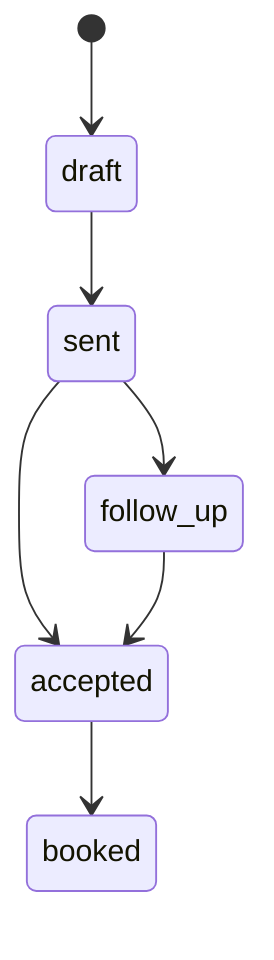

**Debts** are created as quotes with `is_debt = 1` and `status = 'accepted'`. They represent money the customer owes outside of a normal quote workflow.

#### `quote_lines`

| Column | Type | Description |
|---|---|---|
| id | INTEGER PK | |
| quote_id | INTEGER FK | |
| description | TEXT | |
| quantity | REAL | |
| unit_price | INTEGER | Cents |
| service_id | INTEGER FK | Optional link to a product/service |
| line_type | TEXT | `item` or `service` |
| created_at | TEXT | |

### Quote Lifecycle

A quote moves through a series of statuses that represent its progress from proposal to scheduled work.

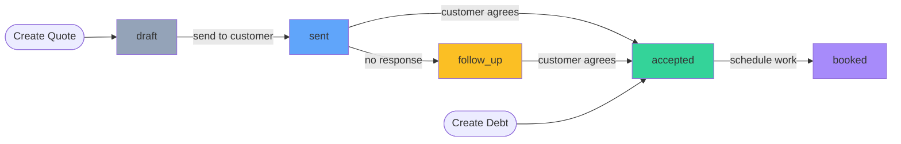

| Status | Meaning | Balance impact |
|---|---|---|
| `draft` | Internal proposal, not yet shared | None -- excluded from balance |
| `sent` | Delivered to the customer | None -- excluded from balance |
| `follow_up` | Sent but no response, needs follow-up | None -- excluded from balance |
| `accepted` | Customer agreed to the terms | Counts toward `total_owed` |
| `booked` | Work has been scheduled via a booking | Counts toward `total_owed` |

**Key rules:**
- Status transitions are not strictly enforced in code beyond the CHECK constraint on valid values. Any valid status can be set via `PATCH /quotes/{id}/status`.
- Only `accepted` and `booked` quotes affect the customer's financial balance.
- A quote's `total_amount` is computed at creation time as the sum of `quantity * unit_price` across its lines. It is not recalculated afterward.
- The `valid_until` field is informational -- the system does not auto-expire quotes.

### Debts

Debts are a special-case quote created via `POST /debts`. They bypass the normal lifecycle:

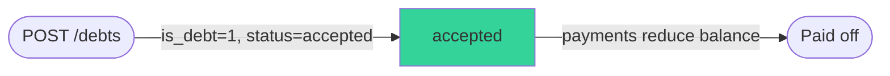

- Created directly in `accepted` status with `is_debt = 1`.
- A single quote line is auto-generated with description = title and quantity = 1.
- Immediately counts toward the customer's balance.
- Paid down through the same payment mechanism as regular quotes.

---

## Payment System

### Tables

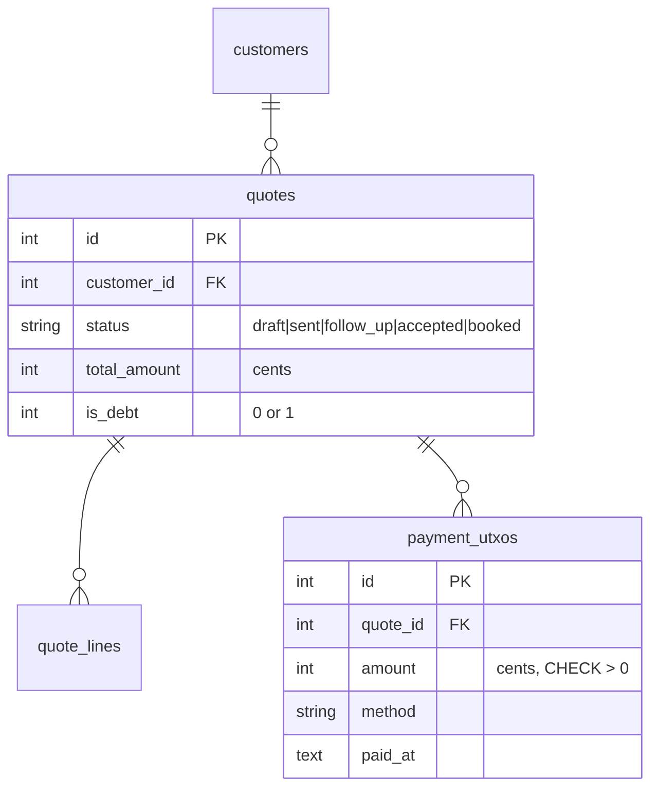

#### `payment_utxos`

An append-only ledger of payments against quotes. Rows are never updated or deleted.

| Column | Type | Description |
|---|---|---|
| id | INTEGER PK | |
| quote_id | INTEGER FK | Which quote this payment applies to |
| amount | INTEGER | Cents. Must be > 0 (CHECK constraint) |
| method | TEXT | e.g. cash, card, transfer, check |
| notes | TEXT | |
| paid_at | TEXT | When the payment was made |
| created_at | TEXT | When the record was created |

### How Customer Balance Is Calculated

The balance is derived from quotes and payments at query time:

```sql
SELECT
    COALESCE(SUM(q.total_amount), 0) as total_owed,
    COALESCE(SUM(COALESCE(p.paid, 0)), 0) as total_paid
FROM quotes q
LEFT JOIN (
    SELECT quote_id, SUM(amount) as paid
    FROM payment_utxos
    GROUP BY quote_id
) p ON p.quote_id = q.id
WHERE q.customer_id = ? AND q.status IN ('accepted', 'booked')
```

- **total_owed** = sum of `total_amount` across all accepted/booked quotes
- **total_paid** = sum of all payments against those quotes
- **outstanding** = total_owed - total_paid

### Key Rules

- Only quotes with status `accepted` or `booked` count toward the balance. Drafts and sent quotes are excluded.
- Payments are validated to be positive (`amount > 0`, CHECK constraint).
- Overpayment is allowed -- it results in a negative outstanding balance (credit).
- The ledger is append-only: payments are never edited or deleted, preserving a full audit trail.

### Payment Lifecycle

Payments follow a simple append-only pattern. There is no editing, voiding, or deleting -- only adding new entries.

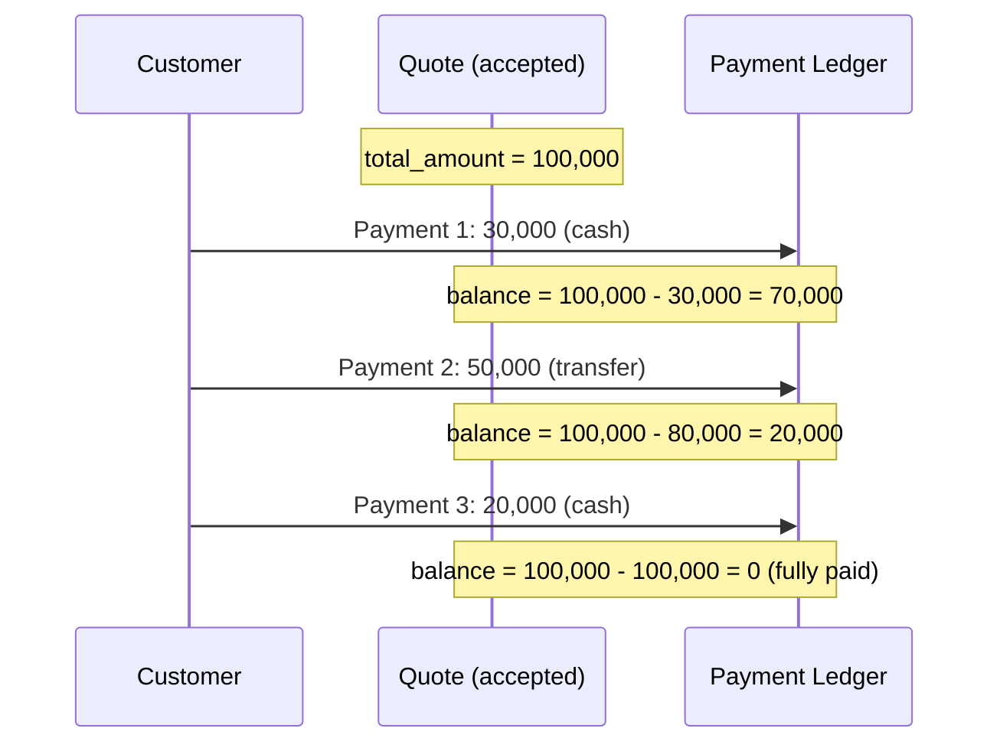

**Recording a payment:**

1. Validate the quote exists (`POST /quotes/{id}/payments`).
2. Validate `amount > 0`.
3. Insert a new row into `payment_utxos` with `quote_id`, `amount`, `method`, and optional `notes`.
4. The balance is never stored -- it is always derived at query time.

**Per-quote balance:**

```
quote.balance = quote.total_amount - SUM(payment_utxos.amount WHERE quote_id = quote.id)
```

**Customer-wide balance:**

```
total_owed    = SUM(quotes.total_amount)  WHERE status IN ('accepted', 'booked')
total_paid    = SUM(payment_utxos.amount) for those quotes
outstanding   = total_owed - total_paid
```

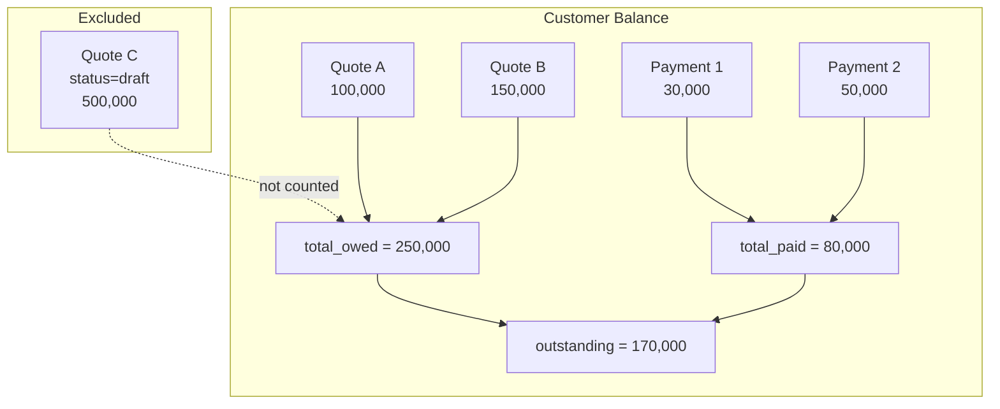

**Edge cases:**
- **Overpayment:** If payments exceed `total_amount`, the balance goes negative, representing a credit.
- **Multiple quotes:** The customer balance aggregates all accepted/booked quotes and all their payments into a single view.
- **Correction:** Since the ledger is append-only, a payment error is corrected by recording a new compensating entry (e.g., a refund as a new debt), not by modifying or deleting existing records.

---

## Relationship Between Quotes, Bookings, and Sales

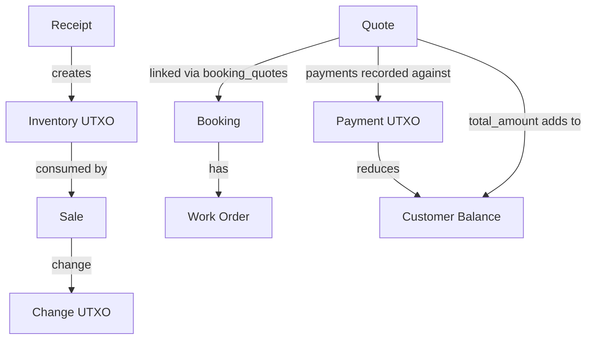

- **Quotes** describe proposed or agreed work/products and their cost.
- **Bookings** schedule when work happens, linking to one or more quotes via `booking_quotes` (many-to-many).
- **Sales** consume inventory UTXOs for physical product sales.
- **Payments** are recorded against quotes, regardless of whether the quote is tied to a sale or a booking.

---

## Database Constraints Summary

| Table | Constraint | Purpose |
|---|---|---|
| `inventory_utxos` | `CHECK (quantity > 0)` | No zero or negative lots |
| `inventory_utxos` | `CHECK (cost_per_unit >= 0)` | No negative costs |
| `inventory_receipt_prices` | `CHECK (price_per_unit >= 0)` | No negative prices |
| `inventory_receipt_prices` | `UNIQUE(receipt_id, product_id, customer_group_id)` | One price per group per receipt |
| `sale_lines` | `CHECK (quantity > 0)` | No zero-quantity sales |
| `sale_line_utxo_inputs` | `CHECK (quantity_used > 0)` | No zero consumption records |
| `payment_utxos` | `CHECK (amount > 0)` | No zero or negative payments |
| `quotes` | `CHECK (status IN (...))` | Valid status values only |
| All FK columns | `REFERENCES ... (id)` | Referential integrity (PRAGMA foreign_keys = ON) |
